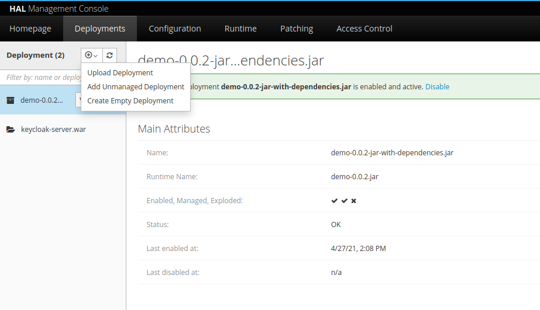

# Keycloak SPI example
An example of implementing a Service Provider Interface (SPI) for Keycloak.

When legacy systems are involved, it is a common requirement to integrate users from those systems. To facilitate this integration, Keycloak supports something called _custom providers_. This particular example illustrates how to build a SPI that integrates a legacy database into Keycloak.

## Building the Module

This is a Java Maven project, so just execute ```mvn clean package```. 
This builds a ```jar``` in the target directory. 

## Installing the module

### Manual

Copy the jar file to  ```${KEYCLOAK_HOME}/standalone/deployments/```. After that, create a file with the same name as the jar file and the extension ```.dodeploy```:

~~~
    ~/standalone/deployments ll
    total 22140
    drwxr-xr-x 2 user user     4096 abr 27 12:56 ./
    drwxr-x--x 8 user user     4096 abr 23 20:33 ../
    -rw-rw-r-- 1 user user 11318774 abr 26 16:27 demo-0.0.1.jar
    -rw-rw-r-- 1 user user        0 abr 27 11:11 demo-0.0.1.jar.dodeploy
~~~

Then start/restart Keycloak instance. If the jar deployment is successful, the _.dodeploy_ file should be changed to _.deployed_ by Keycloak:

~~~
    ~/standalone/deployments ll
    total 22140
    drwxr-xr-x 2 user user     4096 abr 27 12:56 ./
    drwxr-x--x 8 user user     4096 abr 23 20:33 ../
    -rw-rw-r-- 1 user user 11318774 abr 26 16:27 demo-0.0.1.jar
    -rw-rw-r-- 1 user user        0 abr 27 11:11 demo-0.0.1.jar.deployed
~~~

### WildFly

The jar can be deployed using ```WildFly Management Console```, using the ```Deployments``` tab:




## Using the SPI

The new SPI fits in the registration flow of keycloaks registration.

Switch to your realm in the keycloak administration console. Select _User Federation_ option in the left menu and _Add provider_. The new SPI should be listed there, ready to use. 


